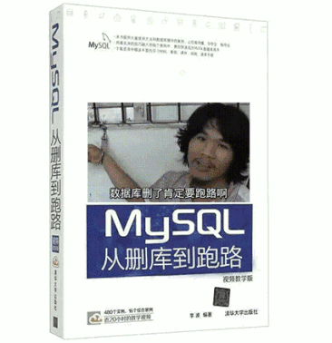
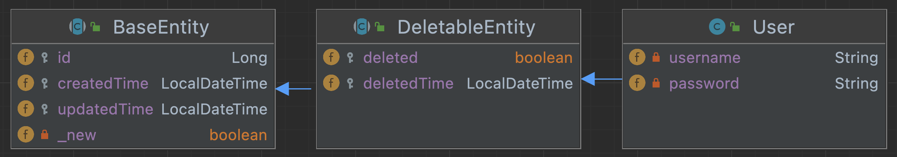

# Spring Boot 数据库逻辑删除最佳实践（MySQL篇）

## 前言

“删库跑路”的段子一直在IT圈里广为流传，意思是互联网公司中掌握重要信息权限的研发和运维人员，由于自身各种不满情绪等原因，在未经公司许可的情况下，删除重要数据和文件，给公司带来惨重的经济损失和客户信任危机。

根据我国《中华人民共和国刑法》第二百八十六条相关规定，破坏计算机信息系统罪，是对计算机信息系统功能进行删除、修改、增加、干扰，造成计算机信息系统不能正常运行，后果严重的，处五年以下有期徒刑或者拘役；后果特别严重的，处五年以上有期徒刑。

除了以上这种主观故意删库行为，还有由于误操作造成的，所以我们需要完善相应的安全机制和管理制度，划分好权限边界，做好数据备份。



数据库四个基本操作：创建、读取、更新和删除，简称`CRUD`，分别对应 Structured Query Language （`SQL`）的`INSERT`、`SELECT`、`UPDATE`和`DELETE`。

但在实际项目中，往往不会有删除权限，取而代之的是逻辑删除（又称软删除），这样做是既是为了防止数据被误删，也是为了方便开发者排查问题和数据恢复。

我们希望能够实现逻辑删除功能的同时能满足以下几点：

- **逻辑删除不影响唯一索引**

  将`deleted`列默认值设置为`0`，类型设置为与`id`（主键）相同的类型，这样做的目的是为了“删除”记录时可以将`id`的值赋给`deleted`。由于创建了`username`和`deleted`的复合唯一索引，因此在数据“已删除”的情况下，可以再新增一条与其相同`username`值的记录，反之“未删除”的数据则不允许再创建。

- **逻辑删除不应该侵入业务**

  业务不应该关联`deleted`及逻辑删除相关的字段（如本例中`deleted_time`字段），且不应该对外展示该字段。

- **逻辑删除应该同物理删除的使用方式**

  开发时应该保持逻辑删除用法和物理删除一致，不应该存在使用门槛和学习成本。

## 准备工作

本例在数据库中定义了一个名为`user`的表，表结构如下：

```sql
create table user
(
    id           bigint primary key auto_increment not null comment '自增主键',
    username     varchar(20)                       not null comment '用户名',
    password     varchar(40)                       not null comment '密码',
    deleted      bigint default 0                  not null comment '删除标识 0:未删除 其他:已删除',
    created_time datetime                          not null comment '创建时间',
    updated_time datetime                          null comment '更新时间',
    deleted_time datetime                          null comment '删除时间',
    constraint uk_user_username unique (username, deleted)
);
```

示例环境如下：

> MySQL版本：8.0.21  
> 储存引擎：InnoDB  
> 字符集：utf8mb4  
> 校对规则：utf8mb4_0900_ai_ci

## 验证

首先我们通过`SQL`初步验证逻辑删除的可行性。

1. 首先新增一条数据。

    ```sql
    insert user (id, username, password, deleted, created_time)
    values (100, 'username', 'password', 0, now());
    ```

2. 然后将其标记为已删除。

    ```sql
    update user
    set deleted=id,
        deleted_time=now()
    where id = 100;
    ```

3. 再新增一条相同`username`值的数据。

    ```sql
    insert user (id, username, password, deleted, created_time)
    values (200, 'username', 'password', 0, now());
    ```
    
    此时数据如下：
    
    | id  | username | password | deleted | created_time        | updated_time | deleted_time        |
    |:----|:---------|:---------|:--------|:--------------------|:-------------|:--------------------|
    | 100 | username | password | 100     | 2022-01-01 00:00:20 |              | 2022-01-01 00:00:39 |
    | 200 | username | password | 0       | 2022-01-01 00:00:11 |              |                     |

4. 如果再新增一条相同`username`值的数据，则会提示：`Duplicate entry 'username-0' for key 'user.uk_user_username'`。

    ```sql
    # Failed
    insert user (id, username, password, deleted, created_time)
    values (300, 'username', 'password', 0, now());
    ```

显然，以上流程的结果符合我们对“逻辑删除不影响唯一索引”的期望。

## 使用Spring Data JPA实现逻辑删除

首先在项目中添加`spring-boot-starter-data-jpa`和`mysql-connector-java`依赖。

```xml
<dependencies>
    <dependency>
        <groupId>org.springframework.boot</groupId>
        <artifactId>spring-boot-starter-data-jpa</artifactId>
        <version>${spring-boot.version}</version>
    </dependency>
    <dependency>
        <groupId>mysql</groupId>
        <artifactId>mysql-connector-java</artifactId>
        <version>${mysql.version}</version>
    </dependency>
</dependencies>
```

### 前置准备

定义一个名为`BaseEntity`的基础实体类，包含所有实体的基本属性，如：主键、创建时间和更新时间等。

```java
import org.springframework.data.annotation.CreatedDate;
import org.springframework.data.annotation.LastModifiedDate;
import org.springframework.data.domain.Persistable;
import org.springframework.data.jpa.domain.support.AuditingEntityListener;

import javax.persistence.Column;
import javax.persistence.EntityListeners;
import javax.persistence.GeneratedValue;
import javax.persistence.GenerationType;
import javax.persistence.Id;
import javax.persistence.MappedSuperclass;
import javax.persistence.PostLoad;
import javax.persistence.Transient;
import java.io.Serializable;
import java.time.LocalDateTime;

@MappedSuperclass
@EntityListeners(AuditingEntityListener.class)
public abstract class BaseEntity<ID extends Serializable> implements Persistable<ID> {
    @Id
    @GeneratedValue(strategy = GenerationType.IDENTITY)
    protected ID id;
    @CreatedDate
    @Column(nullable = false, updatable = false)
    protected LocalDateTime createdTime;
    @LastModifiedDate
    @Column(nullable = true, insertable = false)
    protected LocalDateTime updatedTime;
    @Transient
    private transient boolean _new = true;

    /**
     * 如果返回<code>true</code>则创建数据，否则更新数据。
     *
     * @see javax.persistence.EntityManager#persist(Object)
     * @see javax.persistence.EntityManager#merge(Object)
     */
    @Override
    public boolean isNew() {
        return _new;
    }

    @PostLoad
    void postLoad() {
        this._new = false;
    }

    public void makeInsertable() {
        this._new = true;
    }

    public void makeUpdatable() {
        this._new = false;
    }
    /* Constructor, Getter and Setter */
}
```

定义一个名为`DeletableEntity`的基础实体类，包含逻辑删除所需要的属性，如：删除标识和删除时间等。

```java
import javax.persistence.Column;
import javax.persistence.MappedSuperclass;
import java.io.Serializable;
import java.time.LocalDateTime;

@MappedSuperclass
public abstract class DeletableEntity<ID extends Serializable> extends BaseEntity<ID> {
    @Column(nullable = false, insertable = false)
    protected boolean deleted;
    @Column(nullable = true, insertable = false)
    protected LocalDateTime deletedTime;
    /* Constructor, Getter and Setter */
}
```

定义一个名为`User`的用户实体类，包含用户属性，并在添加`@Where(clause = "deleted = 0")`注解，该注解会在所有查询条件中生效，实现过滤“已删除”的数据的功能。

```java
import org.hibernate.annotations.Where;

import javax.persistence.Column;
import javax.persistence.Entity;
import javax.persistence.Table;

@Entity
@Table(name = "user")
@Where(clause = "deleted = 0")
public class User extends DeletableEntity<Long> {
    @Column(nullable = false, updatable = false)
    private String username;
    private String password;
    /* Constructor, Getter and Setter */
}
```

上述实体类的继承关系如下所示：



然后定义一个名为`DeletableRepository`的接口，添加`@NoRepositoryBean`注解以表示在`Spring`运行时不为其创建实例。

接口中包含`softdeleteById`和`softdeleteAllById`两个方法，主要功能为：通过传入的`id`更新对应数据的`deleted`和`deleted_time`，并返回更新影响行数，开发者可通过影响行数判断数据是否“删除”成功。

```java
import org.springframework.data.jpa.repository.Modifying;
import org.springframework.data.jpa.repository.Query;
import org.springframework.data.repository.CrudRepository;
import org.springframework.data.repository.NoRepositoryBean;
import org.springframework.data.repository.query.Param;

import javax.transaction.Transactional;
import java.util.Collection;

@NoRepositoryBean
public interface DeletableRepository<T extends DeletableEntity, ID> extends CrudRepository<T, ID> {

    @Transactional
    @Modifying
    @Query("update #{#entityName} set deleted = id, deletedTime = :#{T(java.time.LocalDateTime).now()} where id = :id and deleted = 0")
    int softdeleteById(@Param("id") ID id);

    @Transactional
    @Modifying
    @Query("update #{#entityName} set deleted = id, deletedTime = :#{T(java.time.LocalDateTime).now()} where id in :ids and deleted = 0")
    int softdeleteAllById(@Param("ids") Collection<? extends ID> ids);

}
```

最后定义一个继承`DeletableRepository`接口，名为`UserRepository`的接口，包含一个名为`existsByUsername`的方法。

```java
import org.springframework.data.jpa.repository.JpaRepository;

public interface UserRepository extends JpaRepository<User, Long>, DeletableRepository<User, Long> {

    /** 通过用户名判断是否存在用户数据 */
    boolean existsByUsername(String username);

}
```

### 测试查询

调用由`org.springframework.data.repository.CrudRepository`提供的查询方法，从日志中可以发现`@Where(clause = "deleted = 0")`注解已生效。

```java
Optional<User> user = userRepository.findById(100L);
```

```sql
# SQL日志
select user0_.id           as id1_0_0_,
       user0_.created_time as created_2_0_0_,
       user0_.updated_time as updated_3_0_0_,
       user0_.deleted      as deleted4_0_0_,
       user0_.deleted_time as deleted_5_0_0_,
       user0_.password     as password6_0_0_,
       user0_.username     as username7_0_0_
from user user0_
where user0_.id = ?
  and (user0_.deleted = 0)
```

调用自定义的`existsByUsername`方法，从日志中可以发现`@Where(clause = "deleted = 0")`注解也是有效的。

```java
boolean exists = userRepository.existsByUsername("username");
```

```sql
# SQL日志
select user0_.id as col_0_0_
from user user0_
where user0_.username = ?
  and (user0_.deleted = 0)
limit ?
```

通过上述例子，我们发现仅在实体类上添加了`@Where`注解便可实现过滤“已删除”的数据，符合我们对“逻辑删除不应该侵入业务”的期望。

### 测试逻辑删除

调用`DeletableRepository`接口中自定义的`softdeleteById`方法后，通过查询数据库可以发现该数据已被“删除”。

```java
int deleted = userRepository.softdeleteById(100);
```

```sql
# SQL日志
update user
set deleted=id,
    deleted_time=?
where id = ?
  and deleted = 0
```

如果希望杜绝开发者不小心调用了物理删除的方法的情况发生，可以在`DeletableRepository`接口中重写`CrudRepository`接口定义的所有删除方法。

```java
import org.springframework.data.jpa.repository.Modifying;
import org.springframework.data.jpa.repository.Query;
import org.springframework.data.repository.CrudRepository;
import org.springframework.data.repository.NoRepositoryBean;
import org.springframework.data.repository.query.Param;

import javax.transaction.Transactional;
import java.io.Serializable;
import java.util.ArrayList;
import java.util.Collection;
import java.util.List;

@NoRepositoryBean
public interface DeletableRepository<T extends DeletableEntity<ID>, ID extends Serializable> extends CrudRepository<T, ID> {

    @Override
    @Transactional
    @Modifying
    @Query("update #{#entityName} set deleted = id, deletedTime = :#{T(java.time.LocalDateTime).now()} where id = :id and deleted = 0")
    void deleteById(@Param("id") ID id);

    @Override
    @Transactional
    @Modifying
    @Query("update #{#entityName} set deleted = id, deletedTime = :#{T(java.time.LocalDateTime).now()} where id in :ids and deleted = 0")
    void deleteAllById(@Param("ids") Iterable<? extends ID> ids);

    @Override
    @Transactional
    @Modifying
    @Query("update #{#entityName} set deleted = id, deletedTime = :#{T(java.time.LocalDateTime).now()} where deleted = 0")
    void deleteAll();

    @Override
    @Transactional
    default void delete(@Param("entity") T entity) {
        if (entity.getId() != null) {
            this.deleteById(entity.getId());
        }
    }

    @Override
    @Transactional
    default void deleteAll(@Param("entities") Iterable<? extends T> entities) {
        List<ID> ids = new ArrayList<>();
        for (T entity : entities) {
            if (entity.getId() != null) {
                ids.add(entity.getId());
            }
        }
        this.deleteAllById(ids);
    }

}
```

上述例子符合我们对“逻辑删除应该同物理删除的使用方式”的期望。

> 若需要打印上述中测试流程中的SQL日志，请在项目中添加`logging.level.org.hibernate.SQL=debug`配置。

> 示例中`@Id`、`@Column`、`@CreatedDate`、`@LastModifiedDate`、`@Modifying`和`@Query`等注解和类可以查阅 [Spring Data JPA] 文档。

## 总结

我们几乎可以零学习成本的方式实现逻辑删除，保留有价值的数据同时，也能满足业务需求。

但这并不代表本例中逻辑删除的方案是完美无缺的，由于被逻辑删除的数据依旧保留在数据库中，因此随着时间推移，此类业务中“无用”的数据会越来越多，从而影响正常业务的查询效率。解决方法也有很多，例如：定期将“已删除”的数据打包存档。

下一期我们聊聊`MongoDB`逻辑删除的实现方案。

[Spring Boot 数据库逻辑删除最佳实践（MongoDB篇）](../spring-boot-softdelete-mongodb/README.md)

## 示例源码

通过Git下载源码或[直接浏览][spring-boot-softdelete-mysql]。

```bash
git clone https://github.com/yihleego/spring-boot-best-practices.git
cd spring-boot-best-practices/spring-boot-softdelete-mysql
```

## 参考资料

- [Spring Boot]
- [Spring Data JPA]
- [Annotation Type GeneratedValue]

[Spring Boot]:https://spring.io/projects/spring-boot

[Spring Data JPA]:https://docs.spring.io/spring-data/jpa/docs/current/reference/html/#jpa.entity-persistence

[Annotation Type GeneratedValue]:https://docs.oracle.com/javaee/7/api/javax/persistence/GeneratedValue.html

[spring-boot-softdelete-mysql]:https://github.com/yihleego/spring-boot-best-practices/tree/main/spring-boot-softdelete-mysql

